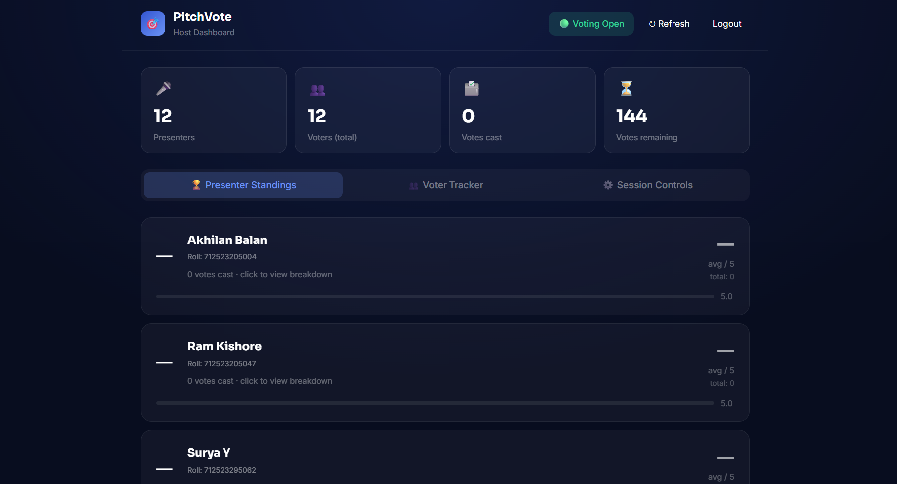

<h1 align="center"><strong>PitchVote — Product Pitch Scoring System</strong></h1>

<p align="center">
  <strong>A simple full-stack platform for product pitch evaluation and scoring.</strong>
</p>

<p align="center">
  <strong>Next.js • React • JavaScript • JWT • Vercel</strong>
</p>

<p align="center">
  <strong>
    <a href="https://pitchvote.vercel.app/host">🌐 Live Application</a>
  </strong>
</p>

---

## 📌 Overview

**PitchVote** is a web-based product pitch scoring system designed for presentation and evaluation sessions.

Voters can securely enter the voting room, select presenters, and submit **1–5 star ratings**. Hosts can monitor voting activity, manage participants, and view presenter standings in real time.

---

## 🖥️ Application Preview

### Voter Login

<p align="center">
  
</p>

### Voter Dashboard

<p align="center">
  
</p>

### Host Dashboard

<p align="center">
  
</p>

---

## ✨ Features

- ⭐ **1–5 Star Presenter Scoring**
- 👥 **Voter and Presenter Management**
- 🏆 **Automatic Presenter Rankings**
- 📊 **Host Voting Dashboard**
- 👀 **Voter Activity Tracking**
- 🔐 **Separate Voter and Host Access**
- ⏱️ **Voting Session Open/Close Control**
- 🔄 **Vote Reset Functionality**
- 📱 **Responsive Interface**

---

## 🛠️ Tech Stack

| Technology | Purpose |
|---|---|
| **Next.js** | Full-stack web application |
| **React** | User interface |
| **JavaScript** | Application logic |
| **JWT** | Authentication |
| **CSS** | Styling |
| **Vercel** | Deployment |
| **Git & GitHub** | Version control |

---

## 🚀 Quick Start

### Prerequisites

- Node.js 18+
- npm or Yarn

### Installation

```bash
git clone YOUR_GITHUB_REPOSITORY_URL
cd PitchVote
npm install
